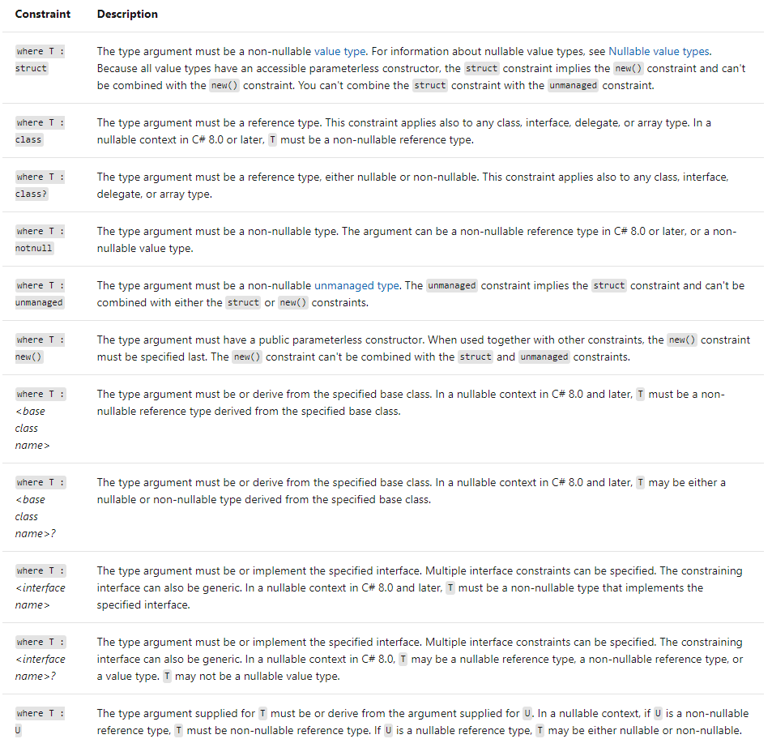

# CSharp-AdvanceTopics
 C# Advance topics: Events, Delegates, Lambda Expressions, LINQ, Async/Await, etc.

## Topics

### Generics

[Generics](https://docs.microsoft.com/es-es/dotnet/csharp/programming-guide/generics/) introduce the concept of type parameters to .NET, which make it possible to design classes and methods that defer the specification of one or more types until the class or method is declared and instantiated by client code.

- [Constraints](https://docs.microsoft.com/es-es/dotnet/csharp/programming-guide/generics/constraints-on-type-parameters) inform the compiler about the capabilities a type argument must have. Without any constraints, the type argument could be any type. The compiler can only assume the members of System.Object, which is the ultimate base class for any .NET type.

